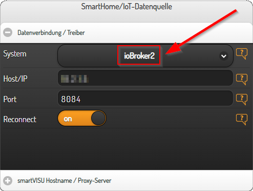

# smartVISU driver for ioBroker backend

`io_iobroker2` is an unofficial [smartVISU](https://github.com/Martin-Gleiss/smartvisu) driver for [iobroker backends](https://www.iobroker.net/). 

## Why should I switch to `io_iobroker2`?

`io_iobroker2` connects your [smartVISU](https://github.com/Martin-Gleiss/smartvisu) visualization to your personal [iobroker](https://www.iobroker.net/) installation using the [ioBroker socket.io adapter](https://github.com/ioBroker/ioBroker.socketio).

The [official driver](https://github.com/Martin-Gleiss/smartvisu/blob/master/driver/io_iobroker.js) writes back any changes to ioBroker as type of `string`. But ioBroker ommits to save values if the type of the value doesn't matches the type of the targetted datapoint. Statechanges for `boolean` datapoints are converted to `number`s like `1` for `true` and `0` for `false`. Conclusion: Your smartVISU visualization will most likely fail to controll many of your ioBroker datapoits or to show the corresponding states.

`io_iobroker2` will perform a "best guess" type conversion for states corresponding to the state's content before writing back to the ioBroker. `io_iobroker2` will also leave statechanges from ioBroker untouched; this affects mostly `boolean` states.

## Installation of the driver

Simply put the driver [io_iobroker2.js](https://github.com/MiGoller/smartvisu_iobroker_driver/blob/main/io_iobroker2.js) into the `driver` folder (e.g. `/var/www/html/driver`) of your smartVISU installation.

## Configuration of the driver

The `io_iobroker2` driver is a replacement for the official `io_iobroker` driver for smartVISU.

If you have configured the `io_iobroker` driver on your smartVISO configuration page, you will just have to select the new `io_iobroker2` driver from the list. 



That's it!

## Usage

### Native installation

See the section "Installation of the driver".

> Simply put the driver [io_iobroker2.js](https://github.com/MiGoller/smartvisu_iobroker_driver/blob/main/io_iobroker2.js) into the `driver` folder (e.g. `/var/www/html/driver`) of your smartVISU installation.

### Docker

You can use the `io_iobroker2` driver with your current Docker image. Just add the driver to your image like you would do with a native installation.

But you can mount the driver into your container as well. Just mount `io_iobroker2.js` to `/var/www/html/driver/io_iobroker2.js`. Don't forget to save the `io_iobroker2.js` to your persistant storage.

#### Sample docker-compose.yml file

This `docker-compose.yml` shows only the mount for the `io_iobroker2` driver!

```yaml
version: '2'
services:
  visu:
    image: ghcr.io/migoller/smartvisu:latest
    networks:
      - default
    volumes:
      # Map date and time settings from Docker host
      - /etc/localtime:/etc/localtime:ro
      - /etc/timezone:/etc/timezone:ro
      
      ...

      # ioBroker2 driver
      - ./io_iobroker2.js/:/var/www/html/driver/io_iobroker2.js:ro
    
      ....
```

### Bundles

My current [smartVISU for Docker](https://github.com/MiGoller/smartvisu-docker) images are bundled with the new `io_iobroker2` driver. Just select the new driver.